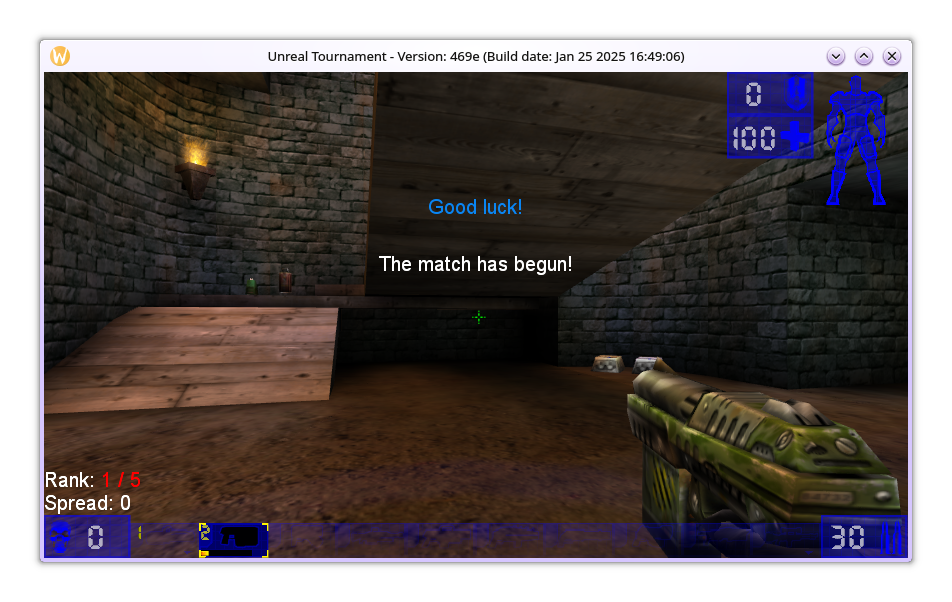

# SimpleMutator
A basic starter Mutator project for Unreal Tournament 1999. For 
use on Linux only, but can be ported to Windows easily.

## Prerequisites
* A legitimate copy of Unreal Tournament. You can obtain
one at [OldUnreal's website](https://www.oldunreal.com/downloads/unrealtournament/).
Installation instructions can be found [here](https://github.com/OldUnreal/UnrealTournamentPatches#installation).

## Usage
- In `build.sh`, and `test.sh`, change the `UT_PATH` variable to where 
your game files are located. The default location is `../__UTDirLinux`, just 
above the project folder.

- Run `build.sh` to build the project. UCC will inform you of any
compilation errors. Files will be stored in the `./Build` directory
for easy access.

- Run `test.sh` to play the game with the mutator installed. Once
the game is finished, the build files will be removed from the 
System folder, so you shouldn't have to worry about conflicts.

- Have fun!

## Resources
* OldUnreal Wiki - [https://www.oldunreal.com/wiki](https://www.oldunreal.com/wiki)
* BeyondUnreal Wiki - [https://beyondunrealwiki.github.io](https://beyondunrealwiki.github.io)
* Unreal Tournament 469e PubSrc - [OldUnreal-UTPatch469e-SDK.tar.bz2](https://github.com/OldUnreal/UnrealTournamentPatches/releases/download/v469e-rc7/OldUnreal-UTPatch469e-SDK.tar.bz2)
